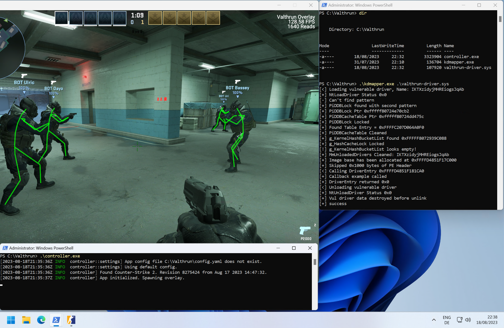
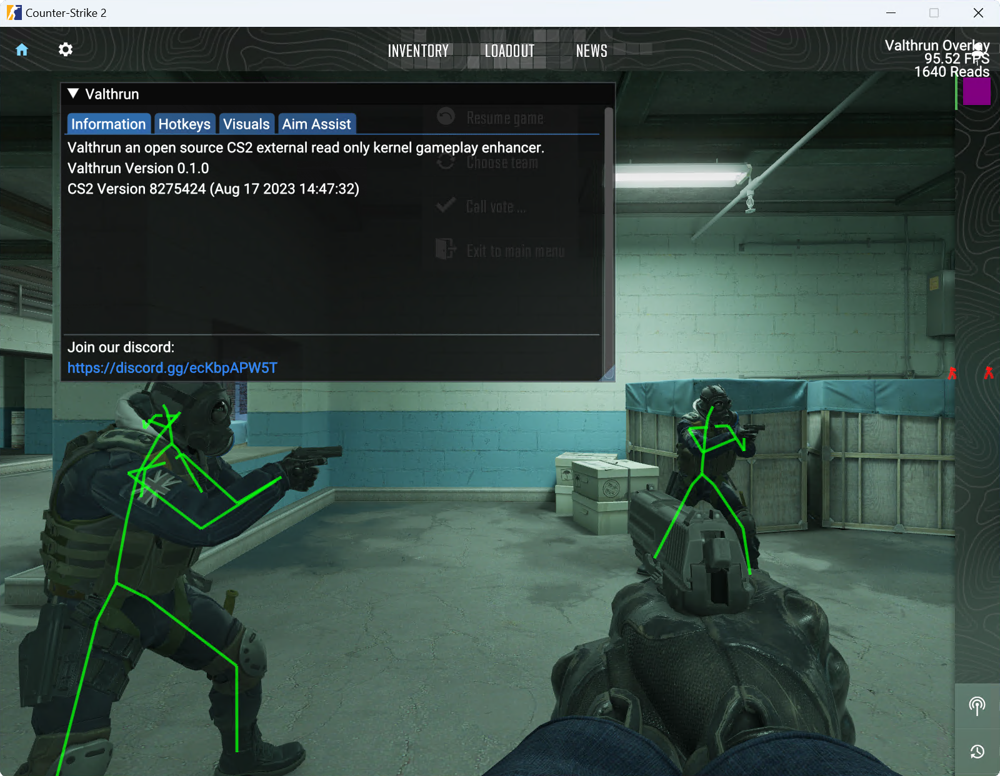

<p align="right">
<a href="https://discord.gg/ecKbpAPW5T">

</a>
</p>

Valthrun is an open source external Counter-Strike 2 read only kernel-level gameplay enhancer.  
That's a lot of descriptive words, but what does each of them mean?  
- `Valthrun` The name of this project
- `Open Source` This application is open source and for everyone to learn from
- `external` We do not inject any DLLs into the target process
- `read only` We do not write to the CS2 process in any way, therefore being impossible to detect by scanning the process memory
- `kernel` We do not use any user level WinAPIs in order to get information from the CS2 process
  
This project is mainly a fun example for exploring the Windows Kernel with [Rust](https://www.rust-lang.org) and exploring the world of game enhancements :)

# WARNING
Valthrun is **not** plug 'n play.  
Please read [How to use](#how-to-use) carefully and try troubleshooting issues on your own.  
The goal is to achieve maximum stealth in order to avoid being detected.
  
# Features
Due to Valthrun being read-only (as of now), there are limitations on what features are possible to implement (eg. skin changer).
Regardless of this limitation, Valthrun supports the following features:  

- Player ESP
  Two modes are supported: `Skeleton` and `Boxes`
  - Configurable colors to distinguish between enemy and team players
  - ESP includes player health
- Bomb Info
  - Time until the bomb detonation
  - Defuser info such as a defuse timer
  - Bomb site where the bomb is located
- Trigger Bot
- Stream proof by default

To access Valthruns settings overlay press `PAUSE`.

## Planned Features
- Aimbot
- Spectator info
  - List of player currently watching you / the observer target
- Player competitive ranks / wins

# Installation
Valthrun does not need to be installed.  
In order to run Valthrun you only need the kernel driver (`valthrun-driver.sys`) and the controller (`controller.exe`).  
  
Both can be accquired by downloading the precompiled release from GitHub.  
Click [here](https://github.com/WolverinDEV/Valthrun/releases) to view all releases.
  
Once downloaded read [How to use](#how-to-use) to get started!

# How to use
The following steps need to be done to enable the overlay.
1. Load the kernel driver  
   The overlay requires the kernel driver for all memory reads and writes.
   Therefore we need to load the driver before we can start the overlay. It's not strictly required to load the driver before starting CS2 but logically it makes sense to start with the driver.
     
   There are two common options to load the kernel driver:
   1. Manually map the driver using a vulnerable driver
      The Valthrun kernel driver fully supports manual driver mapping using a vulnerable driver. In order to detect the manual mapping the second driver entry argument (the registry patch) must be a nullptr.  
      The kernel driver will automatically allocate a new driver for io communication.  

      In order to manually map the Valthrun driver you can use tools like  
      - [kdmapper](https://github.com/TheCruZ/kdmapper) (recommended)
      - [KDU](https://github.com/hfiref0x/KDU) (unstable)

   2. Setting Windows into test-signing mode  
      TODO: Explain how to set Windows into test signing
      Helpful guide: https://github.com/dretax/GarHal_CSGO#starting-driver
   
2. Start Counter-Strike 2  
After loading the driver you can start Counter-Strike 2 as usual.  

3. Start Overlay  
With an open instance of Counter-Strike 2 you can start the overlay.  
Attention: You *must* start the overlay as administrator!  
  
To explore all command line options of the controller, start the controller from the terminal and pass `-h` to display the command line interface:
```ps1
.\controller.exe -h
```

If you want a verbose output (useful for troubleshooting), start the overlay from the terminal and previously set the `RUST_LOG` environment variable.  
Example for executing the overlay with trace output:  
```ps1
$env:RUST_LOG="trace"
.\controller.exe
```

# Troubleshooting
If you are having issues mapping the kernel driver or starting the controller, please take a look [here](https://github.com/WolverinDEV/Valthrun/tree/master/doc/troubleshooting):  
https://github.com/WolverinDEV/Valthrun/tree/master/doc/troubleshooting
  
The issue you encounter is most likely covered. If you still have any questions or need assistance, feel free to checkout the official Valthrun Discord server ([click to join](https://discord.gg/ecKbpAPW5T)).

# VAC
The same considerations as mentioned in [this link](https://github.com/dretax/GarHal_CSGO#starting-driver) have been taken into account.  
With these precautions and some minor improvements, such as omitting the Valthrun identifier and using xor encryption for strings, the driver/overlay should avoid VAC detection. However, I must clarify that I haven't extensively studied VAC, so my conclusion is speculative. Personally, I have been using a C based driver/overlay like this with CSGO for several years without ever getting VAC banned. But be aware of overwatch!  
With VAC live being enabled now, use this with caution. As always take the necessary precautions into consideration.

# Supported Windows Versions
All recent Windows versions should be supported as all functions / struct offsets are resolved dynamically.  
The latest Win 10 and Win 11 versions (22H2) have been tested. User feedback suggests, Windows versions as far back as 20H2 are working.
If you encounter an issue, please submit an issue containing your Windows version and detailing the error you encounter.  
  
# Screenshots



# Help
You can find help on the official Valthrun Discord server:  
[](https://discord.gg/ecKbpAPW5T)
