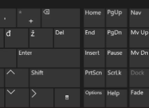
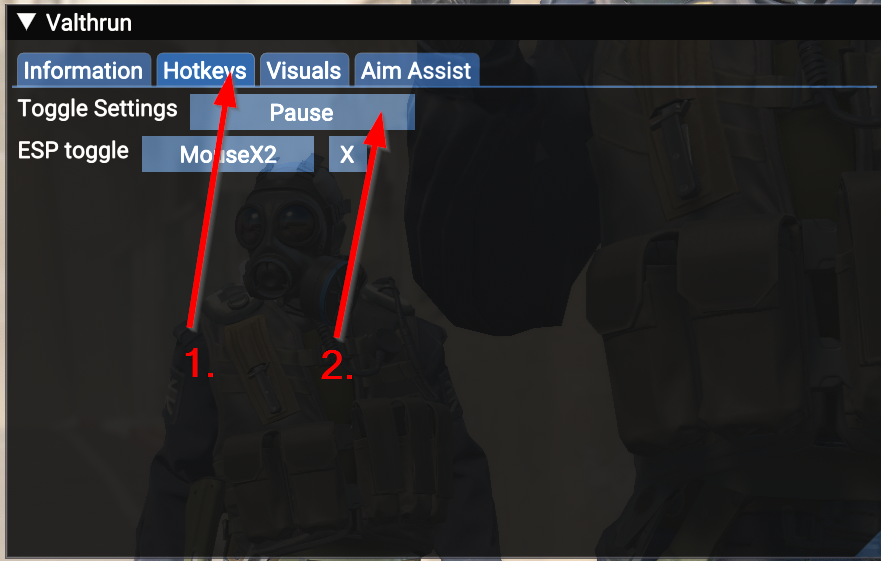

# Open the GUI without a PAUSE key
Some keyboards do not contain a PAUSE key, which is the default key to open the Valthrun overlay menu.  
If you don't have the PAUSE key, you can open the Valthrun menu via the Windows On-Screen Keyboard.
Once opened, you can change the default key to whatever key you wan't to.

1. Press the Windows + R key  
2. Type `osk` and press enter  
3. Press the `PAUSE` key on the right  

1. (Optional) Change the Valthrun menu key  
